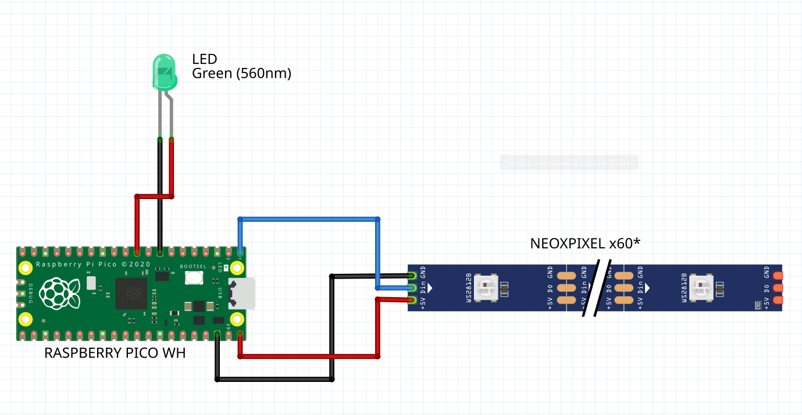

Pour exécuter le programme permettant allumer des LED adressables neopixel depuis un serveur web avec une raspberry pico W

## 1 - Setup la Raspberry Pico W

Suivre les indications du lien suivant :

https://projects.raspberrypi.org/en/projects/get-started-pico-w/1



Pour réinitialiser proprement la Raspberry PICO, maintenir le bouton `BOOTSEL`, puis attendre que l'explorateur indique qu'un nouvel espace de stockage vient d'apparaitre et placer le firmware `flash_nuke.uf2` pour reinitialiser la Raspberry PICO.


## 2 - Installer les dépendances

Pour utiliser les leds, copier/coller le code python `ws2812b.py` sur la raspberry pico W

- Utiliser Thonny Python
- Creer un nouveau fichier du même nom `ws2812b.py`
- l'enregistrer sur la Raspberry Pico

## 3 - Programme principal

- Copier / coller le fichier `main.py` sur la raspberry pico, ce programme s’exécutera à chaque fois que la board sera alimentée.
- Creer un point d'accès avec les creds suivants (pour que la board puisse s'y connecter)

```python
ssid = 'BIOTEC-Escape'
password = 'Biotec1234!'
```

- Lancer le programme via Thonny Python et récupérer l'@IP depuis la sortie du terminal

## 4 - Programme de test "Serveur asynchrone"

Un programme de test permet de tester un server Web asynchrone

`async_webserver.py` récupéré depuis le lien suivant : https://gist.github.com/aallan/3d45a062f26bc425b22a17ec9c81e3b6

## 5 - Programme de test "led"

le programme `led_demo.py` permet de tester le fonctionnement des led sans utiliser un web server.

les leds ont simplement un comportement séquentiel jusqu'à s'éteindre.